<h1 align="center">Rakotonandrasana Landry</h1>
<h3 align="center">Student at 42 Antananarivo | Systems • Networks • DevOps • Cybersecurity</h3>

Linux • Networking • C • DevOps • Automation • Cybersecurity

---

## About Me

I am a **student at 42 Antananarivo** focused on **systems programming, networking, and infrastructure**.  
I work mainly in **Linux environments**, enjoy building low-level programs in **C**, experimenting with **network architectures**, and exploring **DevOps automation and containerized infrastructure**.  

My long-term goal is to work in **DevOps engineering or cybersecurity**, building scalable and secure systems.

---

## Tech Stack

### Programming

### Web

### Systems & Tools

### Networking

- TCP/IP
- Network troubleshooting
- Cisco Packet Tracer
- Basic firewall and routing

---

## 42 Projects

### Minishell
Minimal Unix shell written in **C** with:
- Command parsing
- Pipes & redirections
- Signal handling

### cub3D
Simple **raycasting 3D engine** written in **C**, inspired by early FPS engines.

### Inception
**Docker-based infrastructure project** with:
- NGINX
- WordPress
- MariaDB  
All services run in isolated containers.

### IRC Server
**IRC server implementation in C++98** supporting:
- Multiple clients
- Channel management
- IRC protocol commands

### ft_transcendence
Collaborative **Next.js web application** with interactive gameplay and real-time features.

---

## GitHub Statistics

---

## Contribution Activity

---

## Certifications

**Cisco Networking Academy**
- Python Essentials 1  
- JavaScript Essentials 1  
- Getting Started with Cisco Packet Tracer  

---

## Contact

**LinkedIn:** [Rakotonandrasana Landry](https://www.linkedin.com/in/rakotonandrasana-landry-75a245294/)  
**GitHub:** [larakoto](https://github.com/larakoto)
